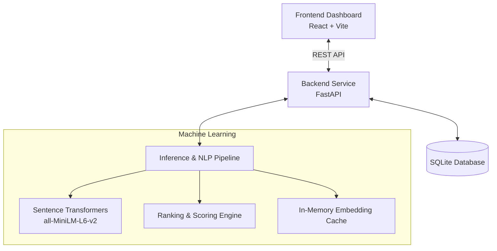

Check out the configuration reference at https://huggingface.co/docs/hub/spaces-config-reference

# Recruitment Decision Support System

A production-grade, AI-powered recruitment platform using semantic matching for candidate evaluation and recruiter decision workflows.

## System Architecture



## Features

- **Semantic Candidate Matching**: Converts job descriptions and candidate profiles into 384-dimensional embeddings to compute similarity.
- **Multi-Factor Scoring**: Evaluates candidate fit using NLP text similarity, exact skill match ratios, experience levels, and education requirements.
- **Recruiter Workflow**: Built-in support for shortlisting, holding, and rejecting candidates in real-time.
- **Performance Optimized**: Uses O(1) in-memory model caching for sub-second candidate ranking and React Query for instantaneous UI optimistic updates.

## Prerequisites

- Node.js
- Python 3.11+
- npm or yarn

## Quick Start

### Option 1: Unified Script (Windows)

The simplest way to start the environment automatically:

```cmd
.\start.bat
```

For PowerShell environments:

```powershell
.\start.ps1
```

On a fresh clone, the script creates `.venv`, installs backend dependencies, seeds `data/app.db` if it does not exist, installs frontend dependencies, boots the FastAPI backend on port `8000`, and starts the React development server on port `5173`.

Default login:

```text
Username: admin
Password: admin123
```

### Option 2: Manual Startup

If you prefer to start the services manually or are on a non-Windows machine:

**Backend**
```bash
cd backend
python -m venv ../.venv
source ../.venv/bin/activate  # Unix/Mac
# ..\.venv\Scripts\activate   # Windows
pip install -r requirements.txt
cd ..
python seed.py
cd backend
uvicorn main:app --reload --port 8000
```

**Frontend**
```bash
cd frontend
npm install
npm run dev
```

The application will be accessible at `http://localhost:5173`.

## Project Layout

```text
recruitment-decision-support-system/
├── backend/             # FastAPI backend and AI pipelines
│   ├── main.py          # API endpoints
│   ├── src/models/      # Semantic embedders and mathematical matchers
│   └── inference/       # AI service wrappers and caching logic
├── frontend/            # React & Vite frontend
│   ├── src/pages/       # Dashboard GUI and views
│   └── src/services/    # API React Query hooks
└── data/                # Local SQLite database
```

## AI Configuration & Inference

The system uses `all-MiniLM-L6-v2` via `sentence-transformers`. The model weights will automatically download to your local cache upon the first execution.

Match evaluation logic relies on the following default distribution, which can be modified in the backend configuration:
- Semantic Description Match (35%)
- Technical Skill Overlap (35%)
- Experience Timeline Match (20%)
- Education Match (10%)

## License

See LICENSE file for details.
